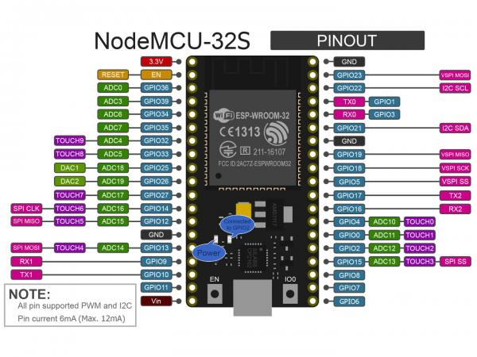

# ESP32
ESP32 Arduino with LoRaWAN Module Project

ESP32 (AI-thinker NodeMCU-32S 核心开发板) 與Gemtek GIoT LoRaWAN(GL6509/G76SXB-H) 連接方式
modules Tx RX 分別接在 GPIO16 RX2 與 GPIO17 TX2 上

** Lab00 ESP32 be a USB2TTL module
